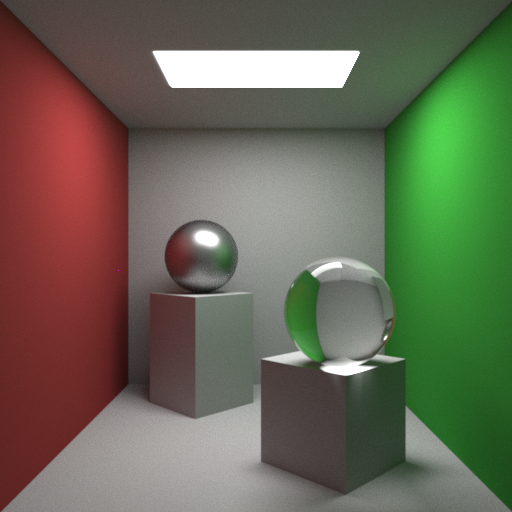
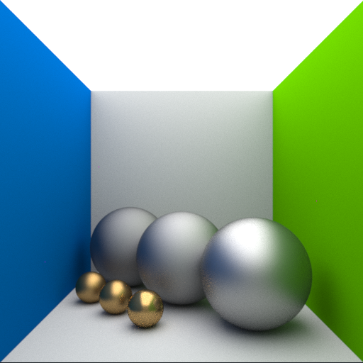
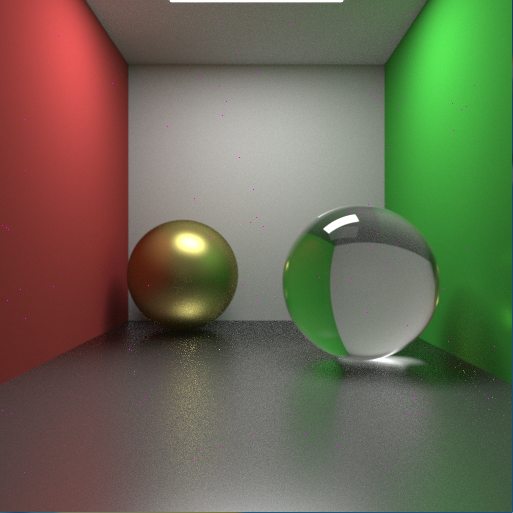

CPPRay
======

A minimalistic path tracer written in C++, inspiration taken from projects like [smallpt](http://kevinbeason.com/smallpt/).

Example Images:
---------------

_512x512 render @ 1000SPPX - .obj meshes._

_512x512 render @ 200SPPX - Cook-torrance microfacet brdf model for glossy specular materials._

_512x512 render @ 1000SPPX - Glossy floor; triangles implemented._
